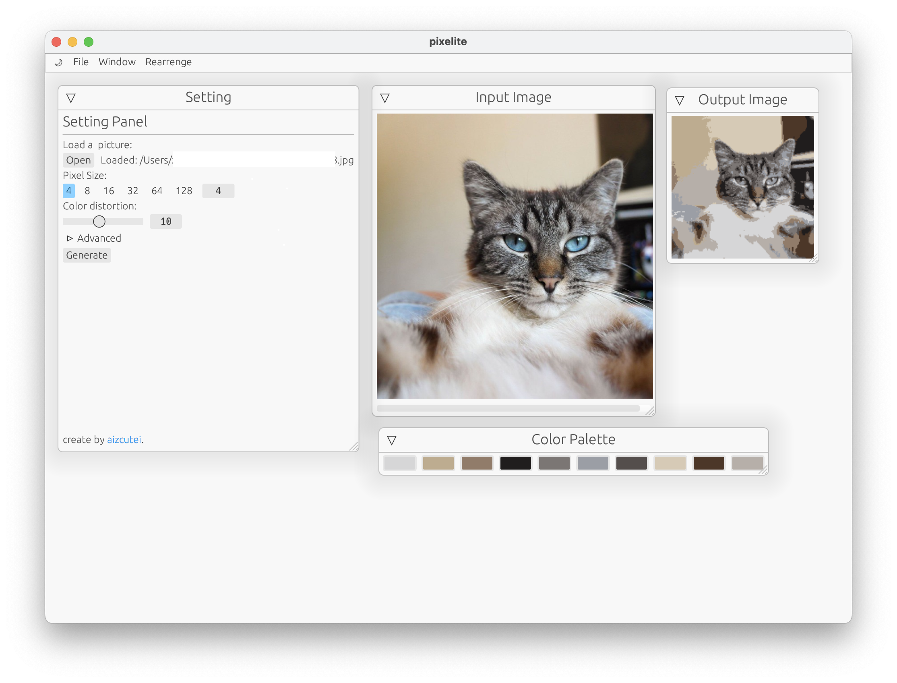

# Pixelite - make image pixel

Pixelite is a simple tool to turn your image into pixel art.



Works on Windows, Linux, Mac and WASM (not good as native).

## Build by source

For native:

```bash
cargo build --release
```

For WASM:

```bash
trunk build --release
```

